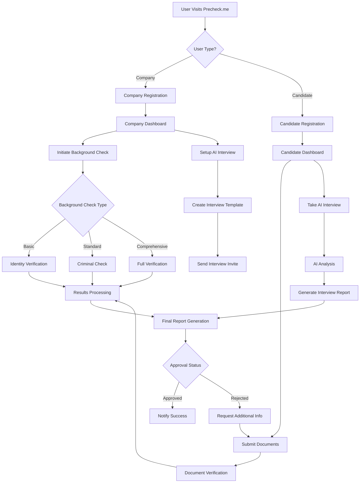
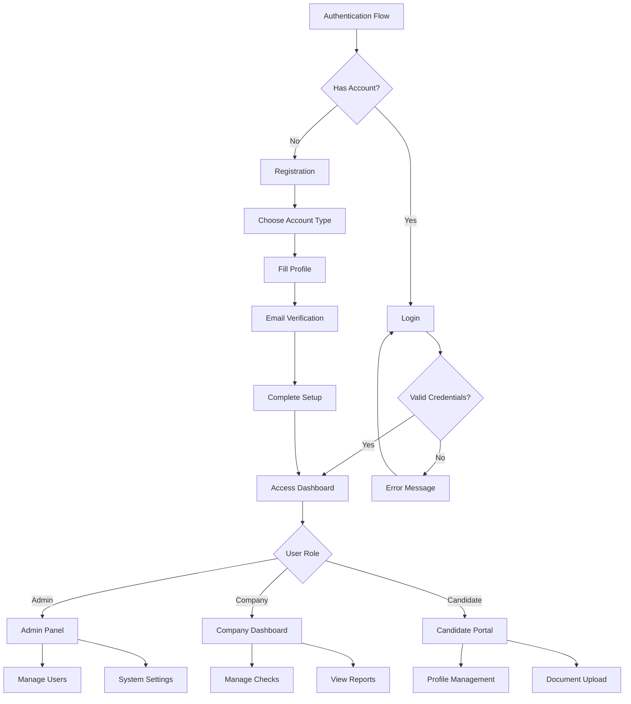
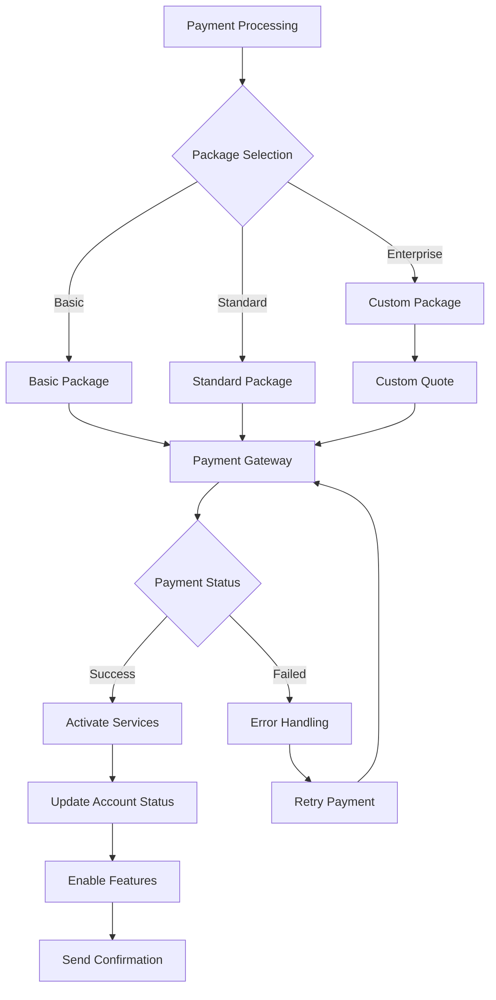
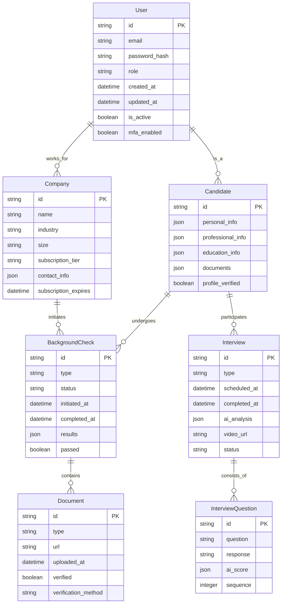
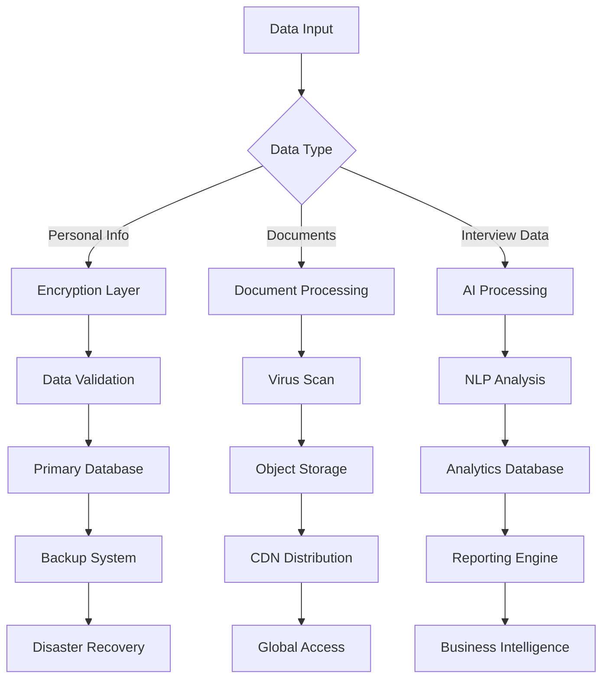
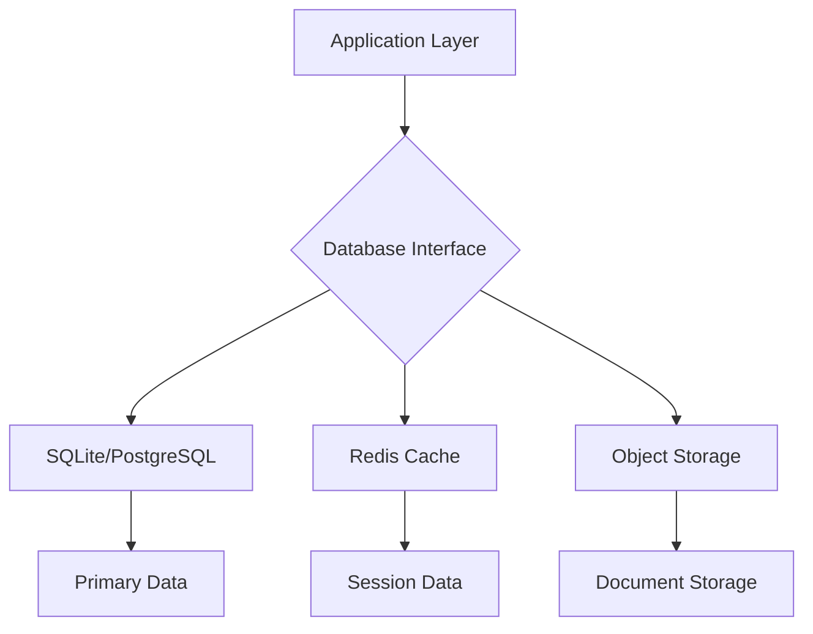
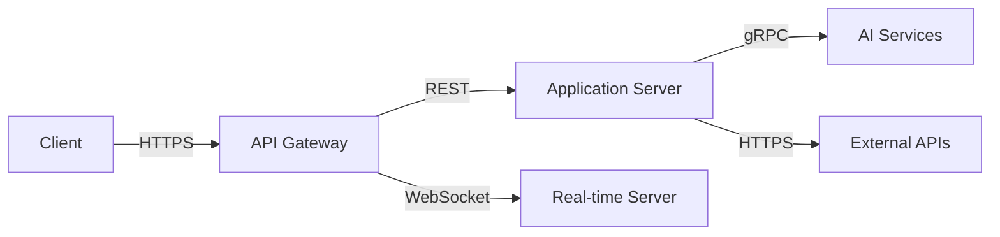

# Product Requirements Document (PRD)

# 1. INTRODUCTION

## 1.1 Purpose

This Software Requirements Specification (SRS) document provides a comprehensive description of the Precheck.me platform. It details the functional and non-functional requirements for developing this background check and AI-powered interview system. The document serves as a definitive reference for:

- Development team members implementing the system
- Project managers overseeing the development process
- Quality assurance teams conducting testing
- Stakeholders reviewing and approving the project scope
- Future maintenance teams maintaining and enhancing the system

## 1.2 Scope

Precheck.me is a AI powered web application that revolutionizes the automated background checks and health checks and any other background checks for marriage alliance and other background checks Core Functionalities

- Centralized background check repository with real-time status tracking
- AI-powered system with natural language processing for verification
- Dynamic candidate profiles with secure information storage
- Company dashboard for managing verification processes
- Multi-tiered service packages for different user needs
- Secure authentication and data protection systems
- API integration capabilities with HRIS and ATS systems

### Key Benefits

- Streamlined hiring process through automation
- Reduced time-to-hire and operational costs
- Enhanced candidate assessment accuracy
- Centralized verification management
- Improved compliance with hiring regulations
- Secure handling of sensitive information
- Scalable solution for organizations of all sizes

### Project Boundaries

#### In Scope

- Web-based platform development using Next.js or what every thats appropreate technology and App Router
- Background check management system
- AI interview implementation
- User management and authentication
- Company and candidate portals
- Payment processing integration
- API development for third-party integration

#### Out of Scope

- Mobile application development
- Physical document verification processes
- In-person interview scheduling
- Employee performance tracking
- Payroll management
- Benefits administration

# 2. PRODUCT DESCRIPTION

## 2.1 Product Perspective

Precheck.me operates as a standalone web application for background checks and standard health checks while integrating with existing HR technology ecosystems and labs that does testing The system architecture consists of:

- Frontend layer built with Next.js or what ever thats appropreate and App Router
- Backend services utilizing Next.js or anything thts approreate API routes
- Supabase database
- Third-party integrations:
  - HRIS and ATS systems via API and also integrate with health care provides like labs who provide testing like health related 
  - Payment processing services
  - Professional networking platforms
  - Document verification services like edication and experince
  - also verify the uploaded document validity like its tampered or not 

## 2.2 Product Functions

- Background Check Management

  - Initiate and track verification requests
  - Store and manage verification documents
  - Generate compliance reports
  - Real-time status updates
  - 
  - Natural language processing analysis

    Custom interview template creation
  - 

- User Management

  - Multi-tenant company profiles
  - Individual candidate portfolios
  - Role-based access control
  - Secure document storage

- Analytics and Reporting

  - Verification process metrics
  - 
  - Compliance monitoring
  - Usage statistics

## 2.3 User Characteristics

### HR Professionals

- Technical proficiency: Intermediate
- Primary needs: Efficient candidate backgound initiation and screening, request testing and screening , compliance management
- Usage frequency: Daily
- Key requirements: Dashboard access, report generation

###  Candidates

- Technical proficiency: Basic to Advanced
- Primary needs: create profile and Profile management,   create self assment page to share like linkedinpage where candiate has eerything about their profile and video explantion about their skills and projects like video and etc 
- Usage frequency: As needed
- Key requirements: Easy navigation, clear instructions

### System Administrators

- Technical proficiency: Advanced
- Primary needs: System maintenance, user management
- Usage frequency: Regular
- Key requirements: Advanced configuration options

## 2.4 Constraints

### Technical Constraints

- Next.js framework limitations
- SQLite database scalability
- Browser compatibility requirements
- API rate limits
- Video storage capacity

### Regulatory Constraints

- GDPR compliance requirements
- CCPA data protection standards
- FCRA background check regulations
- Industry-specific compliance needs
- Data retention policies

### Business Constraints

- Initial market focus on US region and india region 
- Budget limitations for AI processing
- Timeline restrictions for MVP
- Resource availability for support

## 2.5 Assumptions and Dependencies

### Assumptions

- Stable internet connectivity for users
- Browser support for video recording
- User access to required documentation
- Basic technical literacy of users
- English as primary language

### Dependencies

- Third-party API availability
- Cloud infrastructure reliability
- External payment processor uptime
- Background check data providers
- AI service providers
- Authentication service stability

# 3. PROCESS FLOWCHART

# 4. FUNCTIONAL REQUIREMENTS

## 4.1 Authentication System (F001)

### Description

Secure multi-factor authentication system supporting multiple login methods and role-based access control.

### Priority

High

### Requirements Table

| ID | Requirement | Priority |
| --- | --- | --- |
| F001.1 | Support email/password and social login (Google, LinkedIn) authentication | High |
| F001.2 | Implement role-based access control (Admin, Company, Candidate) | High |
| F001.3 | Enable multi-factor authentication via email and SMS | Medium |
| F001.4 | Provide password reset and account recovery functionality | High |
| F001.5 | Implement session management and automatic logout | Medium |

## 4.2 Background Check Management (F002)

### Description

Comprehensive system for initiating, tracking, and managing background verification processes.

### Priority

High

### Requirements Table

| ID | Requirement | Priority |
| --- | --- | --- |
| F002.1 | Support multiple background check types (Basic, Standard, Comprehensive) | High |
| F002.2 | Enable document upload and verification | High |
| F002.3 | Provide real-time status tracking | High |
| F002.4 | Generate automated verification reports | Medium |
| F002.5 | Implement compliance checks and validations | High |

## 4.3 AI Interview System (F003)

### Description

Automated interview system with natural language processing capabilities for candidate assessment.

### Priority

High

### Requirements Table

| ID | Requirement | Priority |
| --- | --- | --- |
| F003.1 | Support video interview recording and storage | High |
| F003.2 | Implement AI-powered question generation | High |
| F003.3 | Provide sentiment and response analysis | Medium |
| F003.4 | Enable custom interview template creation | Medium |
| F003.5 | Generate automated interview assessment reports | High |

## 4.4 User Profile Management (F004)

### Description

Dynamic profile management system for both companies and candidates.

### Priority

Medium

### Requirements Table

| ID | Requirement | Priority |
| --- | --- | --- |
| F004.1 | Enable company profile creation and management | High |
| F004.2 | Support candidate profile creation with resume parsing | High |
| F004.3 | Implement document storage and management | Medium |
| F004.4 | Provide profile visibility controls | Medium |
| F004.5 | Enable profile verification badges | Low |

## 4.5 Payment Processing (F005)

### Description

Secure payment system for processing subscription and service fees.

### Priority

High

### Requirements Table

| ID | Requirement | Priority |
| --- | --- | --- |
| F005.1 | Support multiple payment methods (credit card, ACH) | High |
| F005.2 | Implement subscription management | High |
| F005.3 | Generate invoices and receipts | Medium |
| F005.4 | Process refunds and credits | Medium |
| F005.5 | Provide payment history and reporting | Medium |

## 4.6 API Integration (F006)

### Description

External API system for integration with HRIS and ATS platforms.

### Priority

Medium

### Requirements Table

| ID | Requirement | Priority |
| --- | --- | --- |
| F006.1 | Provide RESTful API endpoints | High |
| F006.2 | Implement API authentication and rate limiting | High |
| F006.3 | Support webhook notifications | Medium |
| F006.4 | Enable data synchronization with external systems | Medium |
| F006.5 | Provide API documentation and SDK | Low |

## 4.7 Reporting and Analytics (F007)

### Description

Comprehensive reporting system for tracking and analyzing platform usage and metrics.

### Priority

Medium

### Requirements Table

| ID | Requirement | Priority |
| --- | --- | --- |
| F007.1 | Generate background check analytics | High |
| F007.2 | Provide interview performance metrics | High |
| F007.3 | Track system usage statistics | Medium |
| F007.4 | Enable custom report generation | Medium |
| F007.5 | Support data export functionality | Low |

# 5. NON-FUNCTIONAL REQUIREMENTS

## 5.1 Performance Requirements (NF001)

| ID | Requirement | Target Metric |
| --- | --- | --- |
| NF001.1 | Page load time | \< 2 seconds for initial load, \< 500ms for subsequent loads |
| NF001.2 | API response time | \< 200ms for 95% of requests |
| NF001.3 | Background check processing | \< 5 minutes for basic checks, \< 24 hours for comprehensive |
| NF001.4 | Video interview processing | \< 30 seconds for AI analysis completion |
| NF001.5 | Concurrent users support | Minimum 1000 simultaneous users |
| NF001.6 | Database query response | \< 100ms for 90% of queries |

## 5.2 Safety Requirements (NF002)

| ID | Requirement | Description |
| --- | --- | --- |
| NF002.1 | Data backup | Automated daily backups with 30-day retention |
| NF002.2 | Failover system | Automatic failover with \< 5 minutes recovery time |
| NF002.3 | Data corruption prevention | Checksums and validation for all file uploads |
| NF002.4 | Error handling | Graceful degradation with user-friendly error messages |
| NF002.5 | Session management | Automatic session termination after 30 minutes of inactivity |

## 5.3 Security Requirements (NF003)

| ID | Requirement | Description |
| --- | --- | --- |
| NF003.1 | Authentication | Multi-factor authentication with OAuth 2.0 support |
| NF003.2 | Data encryption | AES-256 encryption for data at rest, TLS 1.3 for data in transit |
| NF003.3 | Access control | Role-based access control with principle of least privilege |
| NF003.4 | Audit logging | Comprehensive logging of all system access and changes |
| NF003.5 | Password policy | Minimum 12 characters with complexity requirements |
| NF003.6 | API security | JWT-based authentication with rate limiting |

## 5.4 Quality Requirements (NF004)

### 5.4.1 Availability

- System uptime: 99.9% excluding planned maintenance
- Planned maintenance windows: Maximum 4 hours monthly during off-peak
- Automatic monitoring and alerting system

### 5.4.2 Maintainability

- Modular Next.js component architecture
- Comprehensive documentation for all APIs
- Automated testing coverage minimum 80%
- Version control with feature branching strategy

### 5.4.3 Usability

- Mobile-responsive design for all screens
- WCAG 2.1 Level AA compliance
- Maximum 3 clicks to reach any feature
- Intuitive navigation with clear error messages

### 5.4.4 Scalability

- Horizontal scaling capability for web servers
- Database sharding support for future growth
- CDN integration for static assets
- Microservices architecture readiness

### 5.4.5 Reliability

- Mean Time Between Failures (MTBF): \> 720 hours
- Mean Time To Recovery (MTTR): \< 1 hour
- Automated system health checks every 5 minutes
- Zero data loss guarantee for transactions

## 5.5 Compliance Requirements (NF005)

| ID | Requirement | Description |
| --- | --- | --- |
| NF005.1 | GDPR compliance | Data protection measures for EU users |
| NF005.2 | CCPA compliance | California privacy requirements implementation |
| NF005.3 | FCRA compliance | Fair Credit Reporting Act standards for background checks |
| NF005.4 | SOC 2 Type II | Annual audit and certification |
| NF005.5 | ISO 27001 | Information security management standards |
| NF005.6 | EEOC compliance | Equal Employment Opportunity Commission guidelines |
| NF005.7 | Data retention | Configurable retention periods per data type |
| NF005.8 | Audit trails | Complete audit history for 7 years |

# 6. DATA REQUIREMENTS

## 6.1 Data Models

## 6.2 Data Storage

### 6.2.1 Primary Storage

- SQLite for development/testing
- PostgreSQL for production deployment
- Separate databases for user data and analytics

### 6.2.2 File Storage

- S3-compatible object storage for documents and videos
- CDN integration for fast media delivery
- Hierarchical storage management system

### 6.2.3 Data Retention

| Data Type | Retention Period | Storage Location |
| --- | --- | --- |
| User Profiles | 7 years after last activity | Primary Database |
| Background Checks | 7 years | Primary Database + Archive |
| Interview Videos | 1 year | Object Storage |
| Documents | 5 years | Object Storage |
| System Logs | 2 years | Log Management System |
| Analytics Data | 3 years | Analytics Database |

### 6.2.4 Backup Strategy

- Daily incremental backups
- Weekly full backups
- 30-day retention for daily backups
- 1-year retention for weekly backups
- Geographic replication across multiple regions
- Point-in-time recovery capability

## 6.3 Data Processing

### 6.3.1 Data Security Measures

- AES-256 encryption for data at rest
- TLS 1.3 for data in transit
- Field-level encryption for sensitive data
- Key rotation every 90 days
- Data masking for non-privileged users

### 6.3.2 Data Processing Workflows

| Process Type | Processing Time | Security Level |
| --- | --- | --- |
| Document Verification | \< 5 minutes | High |
| Background Check | \< 24 hours | High |
| Interview Analysis | \< 30 minutes | Medium |
| Profile Updates | Real-time | Medium |
| Report Generation | \< 5 minutes | Low |

### 6.3.3 Data Integration

- REST API with rate limiting
- Webhook support for real-time updates
- Batch processing for large data sets
- ETL pipelines for reporting
- Data synchronization with external systems

### 6.3.4 Data Quality Controls

- Input validation at application layer
- Database constraints and triggers
- Regular data integrity checks
- Automated data cleansing
- Quality metrics monitoring

# 7. EXTERNAL INTERFACES

## 7.1 User Interfaces

### 7.1.1 General Requirements

- Responsive design supporting viewport sizes from 320px to 4K
- WCAG 2.1 Level AA compliance
- Dark/light mode support
- Maximum load time of 2 seconds for any interface
- Consistent shadcn/ui component library usage

### 7.1.2 Key Interface Components

| Interface | Description | Key Features |
| --- | --- | --- |
| Company Dashboard | Central management interface | - Background check status cards - Interview management panel - Analytics widgets - Quick action toolbar |
| Candidate Portal | Personal profile and check status | - Document upload interface - Interview scheduling calendar - Progress tracking bars - Notification center |
| Admin Console | System management interface | - User management grid - System health monitors - Configuration panels - Audit logs viewer |
| Interview Platform | AI interview interface | - Video recording controls - Question display panel - Progress indicator - Response review section |

### 7.1.3 Mobile Responsiveness Requirements

| Breakpoint | Layout Adjustments |
| --- | --- |
| \< 640px | Single column, stacked navigation |
| 640px - 1024px | Two column, collapsible sidebar |
| \> 1024px | Full desktop layout with fixed sidebar |

## 7.2 Software Interfaces

### 7.2.1 External Service Integration

| Service Type | Interface Method | Data Format | Purpose |
| --- | --- | --- | --- |
| HRIS Systems | REST API | JSON/XML | Employee data synchronization |
| ATS Platforms | Webhook/REST API | JSON | Candidate information exchange |
| Payment Processors | SDK/API | JSON | Payment processing |
| Document Storage | S3 API | Binary/Base64 | Document management |
| AI Services | gRPC/REST | JSON/Protobuf | Interview analysis |

### 7.2.2 Database Interfaces

### 7.2.3 Third-Party API Dependencies

| API | Version | Purpose | Authentication |
| --- | --- | --- | --- |
| NextAuth.js | v4.x | Authentication | OAuth 2.0 |
| Stripe | v2023-10 | Payments | API Key |
| AWS S3 | v3 | File Storage | IAM |
| SendGrid | v3 | Email Service | API Key |
| OpenAI | v1 | AI Processing | API Key |

## 7.3 Communication Interfaces

### 7.3.1 Network Protocols

| Protocol | Usage | Security |
| --- | --- | --- |
| HTTPS | All web traffic | TLS 1.3 |
| WebSocket | Real-time updates | WSS |
| SMTP | Email notifications | TLS |
| WebRTC | Video interviews | DTLS-SRTP |

### 7.3.2 API Communication

### 7.3.3 Data Exchange Formats

| Format | Use Case | Validation |
| --- | --- | --- |
| JSON | API responses | JSON Schema |
| JWT | Authentication | RS256 |
| Base64 | File transfer | Checksum |
| Protocol Buffers | AI service communication | Schema validation |

## 7.4 Hardware Interfaces

### 7.4.1 Client Hardware Requirements

| Component | Minimum Requirement |
| --- | --- |
| Camera | 720p resolution for video interviews |
| Microphone | 44.1 kHz sampling rate |
| Display | 1280x720 resolution |
| Network | 1.5 Mbps upload/download |
| Storage | 100MB free space for cache |

### 7.4.2 Server Hardware Requirements

| Component | Specification |
| --- | --- |
| CPU | 4 vCPUs minimum |
| RAM | 8GB minimum |
| Storage | 100GB SSD |
| Network | 1Gbps connection |
| Backup | Redundant storage system |

# 8. APPENDICES

## 8.1 GLOSSARY

| Term | Definition |
| --- | --- |
| Background Check | A process of verifying an individual's identity, employment history, education, criminal record, and other relevant information |
| Candidate Profile | A digital portfolio containing personal information, professional history, and verification status |
| Company Dashboard | A centralized interface for managing background checks, interviews, and candidate profiles |
| Document Verification | The process of validating the authenticity of uploaded documents |
| Interview Template | A predefined set of questions and evaluation criteria for AI-powered interviews |
| Service Package | A bundled offering of background check and interview features at different price points |
| Verification Status | The current state of a background check process (pending, in progress, completed, failed) |
| Webhook | A mechanism for real-time notifications when specific events occur in the system |

## 8.2 ACRONYMS

| Acronym | Full Form |
| --- | --- |
| ACH | Automated Clearing House |
| AES | Advanced Encryption Standard |
| API | Application Programming Interface |
| ATS | Applicant Tracking System |
| CCPA | California Consumer Privacy Act |
| CDN | Content Delivery Network |
| DTLS | Datagram Transport Layer Security |
| EEOC | Equal Employment Opportunity Commission |
| ETL | Extract, Transform, Load |
| FCRA | Fair Credit Reporting Act |
| GDPR | General Data Protection Regulation |
| gRPC | Google Remote Procedure Call |
| HRIS | Human Resource Information System |
| IAM | Identity and Access Management |
| JWT | JSON Web Token |
| MFA | Multi-Factor Authentication |
| NLP | Natural Language Processing |
| REST | Representational State Transfer |
| SDK | Software Development Kit |
| SMTP | Simple Mail Transfer Protocol |
| SOC | Service Organization Control |
| SRTP | Secure Real-time Transport Protocol |
| TLS | Transport Layer Security |
| WCAG | Web Content Accessibility Guidelines |
| WSS | WebSocket Secure |

## 8.3 ADDITIONAL REFERENCES

### Technical Documentation

- Next.js Documentation: https://nextjs.org/docs
- shadcn/ui Component Library: https://ui.shadcn.com
- NextAuth.js Authentication: https://next-auth.js.org
- Tailwind CSS Framework: https://tailwindcss.com

### Compliance Resources

- GDPR Official Documentation: https://gdpr.eu
- CCPA Compliance Guide: https://oag.ca.gov/privacy/ccpa
- FCRA Requirements: https://www.ftc.gov/legal-library/browse/statutes/fair-credit-reporting-act
- EEOC Guidelines: https://www.eeoc.gov/laws/guidance

### Security Standards

- OWASP Security Guidelines: https://owasp.org/www-project-web-security-testing-guide
- ISO 27001 Standards: https://www.iso.org/isoiec-27001-information-security.html
- SOC 2 Compliance: https://www.aicpa.org/soc2

### API Documentation

- OpenAPI Specification: https://swagger.io/specification
- REST API Best Practices: https://restfulapi.net
- WebSocket Protocol: https://datatracker.ietf.org/doc/html/rfc6455

### Development Tools

- PostgreSQL Documentation: https://www.postgresql.org/docs
- Redis Documentation: https://redis.io/documentation
- AWS S3 Developer Guide: https://docs.aws.amazon.com/s3