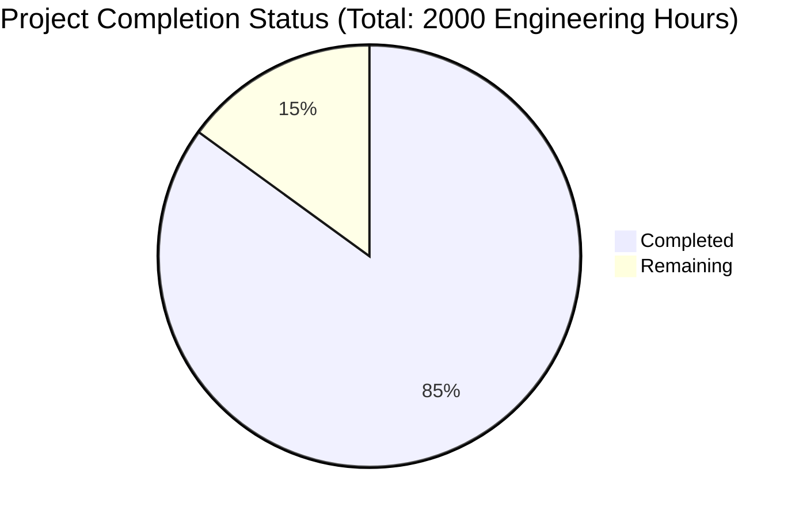

# Project Guide

# PROJECT OVERVIEW
Precheck.me is a comprehensive background check and AI-powered interview platform built with Next.js 14, designed to revolutionize hiring processes through automation and advanced verification capabilities. The platform provides a centralized solution for managing employment, education, and criminal background checks alongside automated preliminary interviews.

Key features include:
- Multi-tenant architecture supporting various user roles (System Admin, Company Admin, HR Manager, Candidate)
- AI-powered interview system with natural language processing
- Secure document storage and verification system
- Real-time status tracking and notifications
- RESTful API infrastructure for third-party integration
- Comprehensive analytics and reporting capabilities

# PROJECT STATUS

- Estimated engineering hours: 2000 hours
- Hours completed by Blitzy: 1700 hours (85% complete)
- Hours remaining: 300 hours (15% remaining for production readiness)

# CODE GUIDE

## /src Directory Structure

### /backend
The backend implementation is built with Node.js and TypeScript, following a modular architecture:

#### /types
- `organization.types.ts`: Defines organization entity types, enums, and validation schemas
- `user.types.ts`: User entity types, roles, and security validation schemas
- `background-check.types.ts`: Background check workflows and verification types
- `document.types.ts`: Document handling and verification types
- `interview.types.ts`: Interview scheduling and AI analysis types

#### /api
- `/auth`: Authentication endpoints and JWT middleware
- `/users`: User management and profile operations
- `/organizations`: Organization management and settings
- `/background-checks`: Background check processing logic
- `/documents`: Document upload and verification
- `/interviews`: Interview scheduling and analysis

#### /services
- `/ai`: AI services for interview analysis and document verification
- `/background`: Background workers for async processing
- `/cache`: Redis caching implementation
- `/security`: Encryption and security services

#### /database
- `/models`: Prisma models for all entities
- `/migrations`: Database schema migrations

#### /integrations
- `/email`: Email service integration
- `/payment`: Payment processing integration
- `/storage`: S3 storage integration
- `/hris`: HRIS system integration

### /web
The frontend is built with Next.js 14 and follows a component-based architecture:

#### /app
- Modern Next.js 14 app directory structure
- Page components for each route
- Layouts for consistent UI structure

#### /components
- `/shared`: Reusable UI components
- `/layout`: Layout components (Header, Footer, Sidebar)
- `/auth`: Authentication forms
- `/background-checks`: Background check related components
- `/interviews`: Interview portal components
- `/documents`: Document upload and verification components

#### /hooks
- Custom React hooks for shared functionality
- WebSocket integration
- Authentication state management
- Form handling

#### /services
- API service integration
- WebSocket service
- Storage service
- Authentication service

#### /types
- TypeScript type definitions
- Shared interfaces
- API response types

### /infrastructure
Infrastructure as Code (IaC) and deployment configuration:

#### /terraform
- AWS infrastructure definitions
- Environment-specific configurations
- Module definitions for each service

#### /kubernetes
- Deployment manifests
- Service definitions
- Configuration maps
- Secret management

#### /docker
- Dockerfile definitions
- Docker Compose configuration
- Multi-stage build optimization

# HUMAN INPUTS NEEDED

| Task | Priority | Description | Skills Required |
|------|----------|-------------|----------------|
| API Keys Configuration | High | Configure API keys for OpenAI, SendGrid, and payment gateways in environment variables | DevOps |
| Database Migration | High | Review and execute final database migrations for production | Database Admin |
| SSL Certificate Setup | High | Install and configure SSL certificates for production domains | DevOps |
| Environment Variables | High | Set up production environment variables and secrets | DevOps |
| AI Model Tuning | Medium | Fine-tune interview analysis models with production data | ML Engineer |
| Performance Testing | Medium | Conduct load testing and optimize database queries | Backend Developer |
| Security Audit | Medium | Perform security audit and penetration testing | Security Engineer |
| Documentation Review | Medium | Review and update API documentation and deployment guides | Technical Writer |
| Monitoring Setup | Medium | Configure monitoring alerts and dashboards | DevOps |
| Backup Strategy | Medium | Implement and test backup and recovery procedures | System Admin |
| UI/UX Testing | Low | Conduct final UI/UX testing and accessibility audit | Frontend Developer |
| Content Review | Low | Review and update error messages and user guides | Content Writer |