# Technical Specifications

# 1. INTRODUCTION

## 1.1 Executive Summary

Precheck.me is a comprehensive background check and AI-powered interview platform designed to revolutionize hiring processes through automation and advanced verification capabilities. The system addresses the critical business challenges of lengthy, manual background verification processes and inconsistent candidate screening by providing a centralized, AI-enhanced solution for managing employment, education, and criminal background checks alongside automated preliminary interviews.

The platform serves HR professionals, hiring managers, candidates, and system administrators by delivering a secure, compliant, and efficient verification ecosystem that significantly reduces time-to-hire while improving the accuracy and reliability of background checks.

## 1.2 System Overview

### Project Context

| Aspect | Description |
|--------|-------------|
| Market Position | First-to-market comprehensive background check platform with integrated AI interview capabilities |
| Current Limitations | Manual verification processes, fragmented systems, lengthy turnaround times |
| Enterprise Integration | Seamless integration with existing HRIS and ATS systems through REST APIs |

### High-Level Description

The system implements a modern web application architecture using Next.js, featuring:

- Centralized background check repository with real-time status tracking
- AI-powered interview system with natural language processing
- Multi-tenant architecture supporting various user roles
- Secure document storage and verification system
- RESTful API infrastructure for third-party integration
- Comprehensive analytics and reporting capabilities

### Success Criteria

| Metric | Target |
|--------|---------|
| Background Check Processing Time | 80% reduction vs. manual process |
| System Availability | 99.9% uptime |
| User Adoption Rate | 70% within first year |
| Verification Accuracy | 99.99% accuracy rate |
| Cost Reduction | 60% reduction in verification costs |

## 1.3 Scope

### In-Scope Elements

#### Core Features

- User authentication and authorization
- Background check initiation and management
- AI-powered interview system
- Document verification and storage
- Real-time status tracking
- Compliance reporting
- Payment processing
- API integration framework

#### Implementation Boundaries

| Boundary Type | Coverage |
|--------------|-----------|
| Geographic | United States and India initially |
| User Groups | HR professionals, candidates, system administrators |
| Data Domains | Personal information, employment history, education records, criminal records |
| Verification Types | Identity, employment, education, criminal background |

### Out-of-Scope Elements

- Mobile application development
- Physical document verification processes
- In-person interview scheduling
- Employee performance tracking
- Payroll management
- Benefits administration
- International background checks (except India)
- Drug testing coordination
- Reference check automation
- Social media screening

# 2. SYSTEM ARCHITECTURE

## 2.1 High-Level Architecture

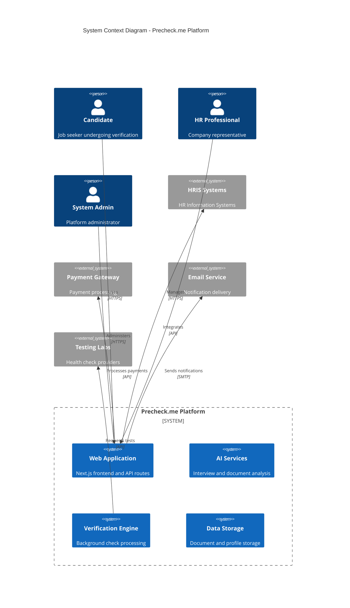

## 2.2 Component Details

### 2.2.1 Container Architecture

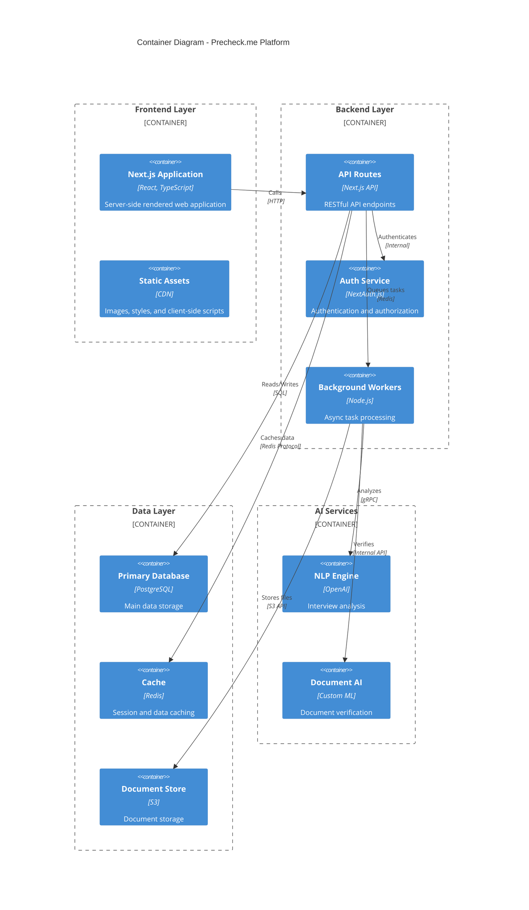

### 2.2.2 Component Specifications

| Component | Technology | Purpose | Scaling Strategy |
|-----------|------------|---------|------------------|
| Web Frontend | Next.js 14 | User interface and SSR | Horizontal scaling with CDN |
| API Layer | Next.js API Routes | Business logic and data access | Load balanced instances |
| Auth Service | NextAuth.js | Authentication management | Session replication |
| Background Workers | Node.js | Async task processing | Queue-based scaling |
| Primary Database | PostgreSQL | Transactional data storage | Read replicas, sharding |
| Cache Layer | Redis | Performance optimization | Cluster mode |
| Document Storage | S3-compatible | File management | CDN distribution |
| AI Services | OpenAI/Custom ML | Intelligent processing | Serverless scaling |

## 2.3 Technical Decisions

### 2.3.1 Architecture Patterns

```mermaid
flowchart TD
    subgraph "Architecture Patterns"
        A[Monolithic Frontend] --> B[API-First Backend]
        B --> C[Event-Driven Processing]
        C --> D[Microservices for AI]
    end

    subgraph "Communication Patterns"
        E[REST APIs] --> F[WebSocket Real-time]
        F --> G[Message Queues]
        G --> H[Event Streaming]
    end

    subgraph "Data Patterns"
        I[CQRS] --> J[Event Sourcing]
        J --> K[Cache-Aside]
        K --> L[Data Sharding]
    end
```

### 2.3.2 Storage Solutions

| Data Type | Storage Solution | Justification |
|-----------|-----------------|----------------|
| User Data | PostgreSQL | ACID compliance, relational integrity |
| Sessions | Redis | Fast access, automatic expiration |
| Documents | S3 Storage | Scalable, cost-effective |
| Logs | ELK Stack | Search capabilities, retention policies |
| Analytics | ClickHouse | Column-oriented, fast aggregations |

## 2.4 Cross-Cutting Concerns

### 2.4.1 System Monitoring

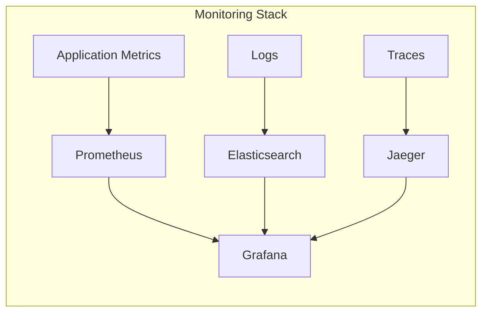

### 2.4.2 Deployment Architecture

```mermaid
C4Deployment
    title Deployment Diagram - Precheck.me Platform

    Deployment_Node(cdn, "CDN", "Global Edge Network") {
        Container(assets, "Static Assets", "CDN-distributed content")
    }

    Deployment_Node(cloud, "Cloud Infrastructure") {
        Deployment_Node(web, "Web Tier") {
            Container(app, "Next.js App", "Web application instances")
        }
        
        Deployment_Node(data, "Data Tier") {
            Container(db, "PostgreSQL", "Primary database")
            Container(redis, "Redis", "Cache cluster")
        }
        
        Deployment_Node(storage, "Storage Tier") {
            Container(s3, "S3 Storage", "Document storage")
        }
    }

    Deployment_Node(ai, "AI Services") {
        Container(ml, "ML Services", "AI processing nodes")
    }

    Rel(cdn, web, "Routes requests", "HTTPS")
    Rel(web, data, "Persists data", "Internal")
    Rel(web, storage, "Stores files", "Internal")
    Rel(web, ai, "Processes", "Internal")
```

### 2.4.3 Security Architecture

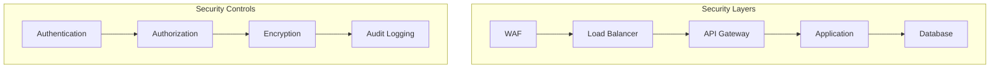

# 3. SYSTEM COMPONENTS ARCHITECTURE

## 3.1 USER INTERFACE DESIGN

### 3.1.1 Design Specifications

| Aspect | Requirement |
|--------|-------------|
| Visual Hierarchy | Material Design 3.0 principles with clear visual hierarchy |
| Component Library | shadcn/ui with custom theme extensions |
| Responsive Design | Mobile-first approach with breakpoints at 640px, 768px, 1024px, 1280px |
| Accessibility | WCAG 2.1 Level AA compliance |
| Browser Support | Latest 2 versions of Chrome, Firefox, Safari, Edge |
| Theme Support | System-default dark/light mode with manual override |
| i18n Support | English (US/UK), Hindi initial languages |

### 3.1.2 Interface Elements

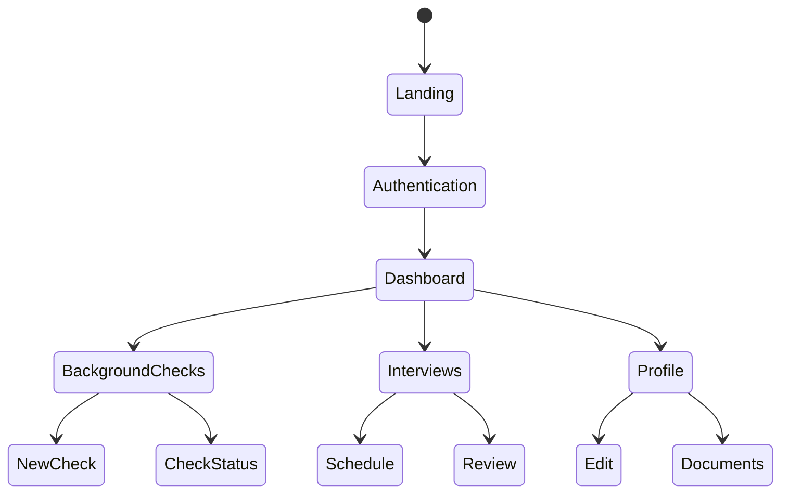

### 3.1.3 Critical User Flows

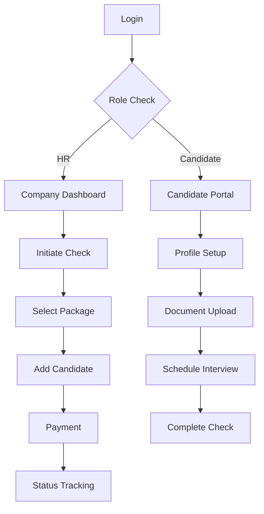

## 3.2 DATABASE DESIGN

### 3.2.1 Schema Design

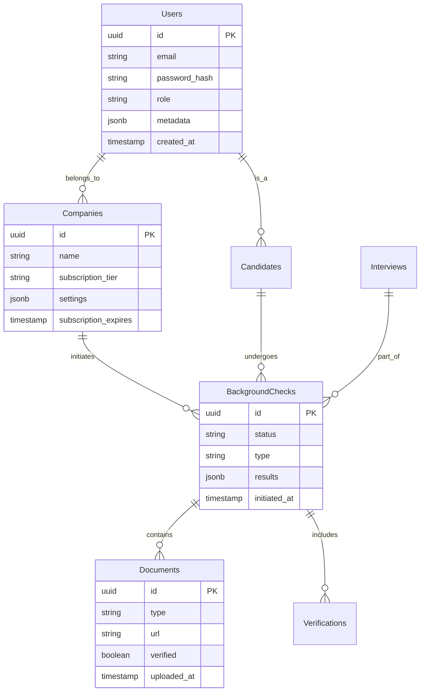

### 3.2.2 Data Management Strategy

| Aspect | Strategy |
|--------|----------|
| Migrations | Incremental with rollback support |
| Versioning | Semantic versioning for schema changes |
| Archival | Automated archival after 2 years |
| Retention | 7-year retention for compliance data |
| Privacy | Field-level encryption for PII |
| Auditing | Temporal tables for all critical entities |

### 3.2.3 Performance Optimization

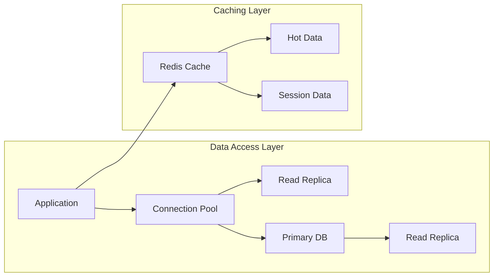

## 3.3 API DESIGN

### 3.3.1 API Architecture

| Component | Specification |
|-----------|--------------|
| Protocol | REST over HTTPS |
| Authentication | JWT with OAuth 2.0 |
| Rate Limiting | 1000 requests/hour per client |
| Versioning | URI-based (/v1/, /v2/) |
| Documentation | OpenAPI 3.0 Specification |
| Security | CORS, CSP, API Keys |

### 3.3.2 Interface Specifications

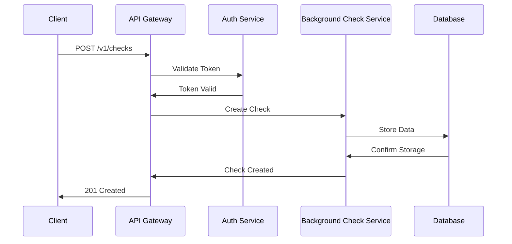

### 3.3.3 Integration Requirements

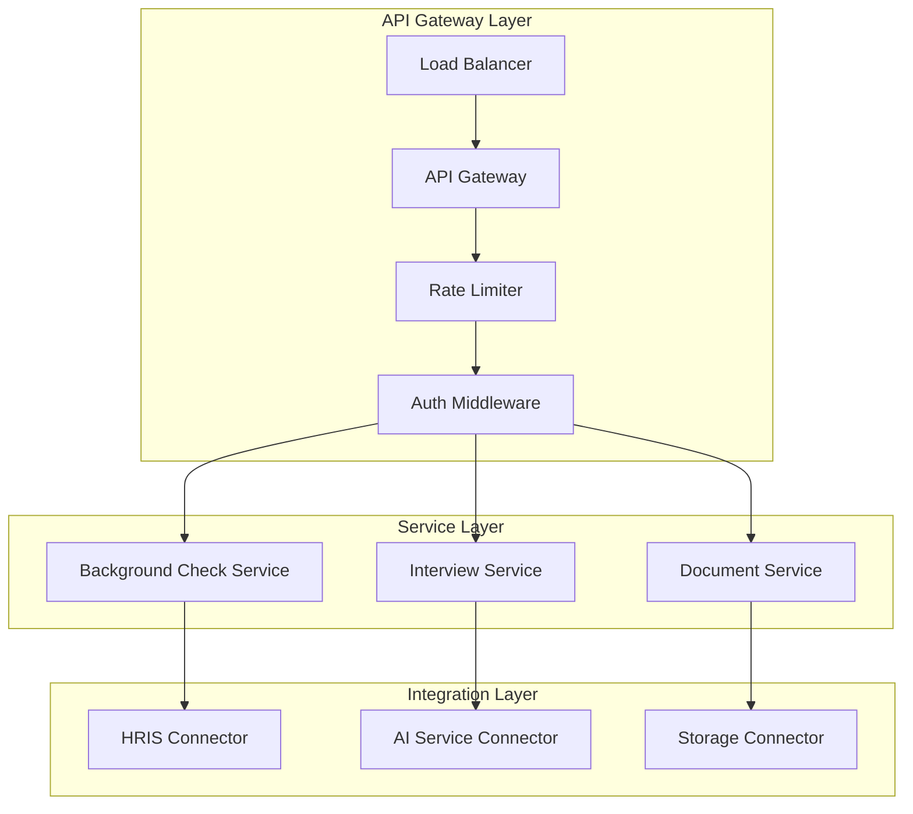

| Integration Point | Requirements |
|------------------|--------------|
| HRIS Systems | REST API with OAuth 2.0 |
| Payment Processors | PCI-DSS compliant endpoints |
| Document Storage | S3-compatible API |
| AI Services | gRPC with TLS |
| Email Service | SMTP with DKIM |

# 4. TECHNOLOGY STACK

## 4.1 PROGRAMMING LANGUAGES

| Platform/Component | Language | Version | Justification |
|-------------------|----------|---------|---------------|
| Frontend | TypeScript | 5.2+ | Type safety, better IDE support, reduced runtime errors |
| Backend | Node.js | 20.x LTS | JavaScript runtime consistency, extensive package ecosystem |
| Infrastructure | Go | 1.21+ | High performance for background workers, excellent concurrency |
| Scripts/Automation | Python | 3.11+ | Rich ecosystem for AI/ML tasks, excellent for automation |

## 4.2 FRAMEWORKS & LIBRARIES

### Core Frameworks

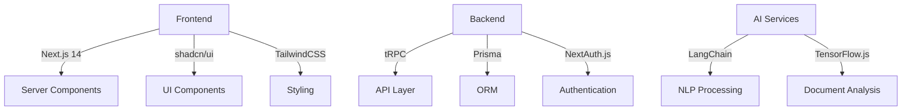

| Framework | Version | Purpose | Justification |
|-----------|---------|---------|---------------|
| Next.js | 14.0+ | Full-stack framework | Server components, file-based routing, API routes |
| tRPC | 10.x | Type-safe API | End-to-end typesafety, excellent DX |
| Prisma | 5.x | Database ORM | Type-safe queries, schema migrations |
| LangChain | 0.1.x | AI/ML operations | Simplified AI integration, extensive model support |

## 4.3 DATABASES & STORAGE

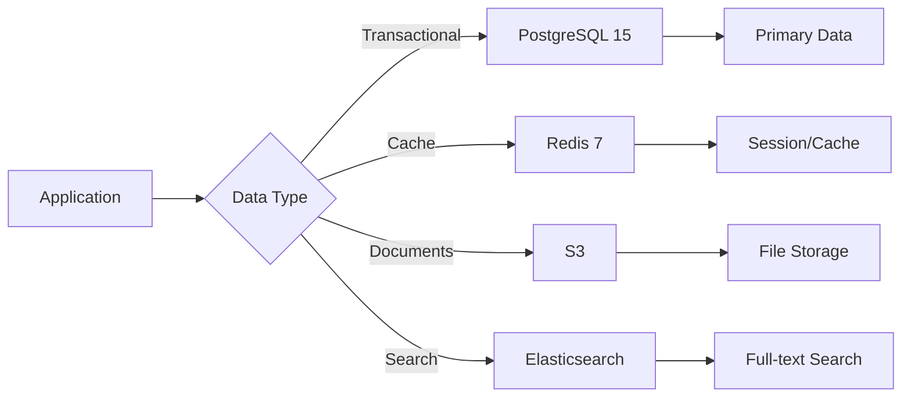

### Storage Strategy

| Data Type | Solution | Purpose | Configuration |
|-----------|----------|---------|---------------|
| Primary Database | PostgreSQL | Transactional data | Multi-AZ, automated backups |
| Cache Layer | Redis | Session, API cache | Cluster mode, persistence |
| Document Storage | S3 | Files, documents | Versioning, lifecycle policies |
| Search Engine | Elasticsearch | Full-text search | Auto-scaling, replication |

## 4.4 THIRD-PARTY SERVICES

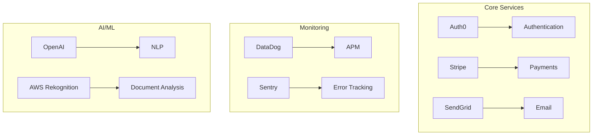

| Service Category | Provider | Purpose | Integration Method |
|-----------------|----------|---------|-------------------|
| Authentication | Auth0 | Identity management | OAuth 2.0/OIDC |
| Payments | Stripe | Payment processing | REST API |
| Email | SendGrid | Transactional email | SMTP/API |
| Monitoring | DataDog | Application monitoring | Agent/API |
| Error Tracking | Sentry | Error reporting | SDK |
| AI Services | OpenAI | Natural language processing | REST API |

## 4.5 DEVELOPMENT & DEPLOYMENT

### Development Pipeline

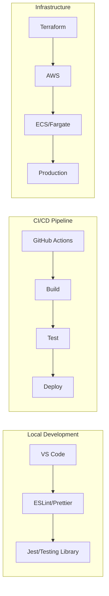

### Environment Configuration

| Environment | Infrastructure | Deployment Method | Monitoring |
|-------------|---------------|-------------------|------------|
| Development | Local Docker | Direct deployment | Basic logging |
| Staging | AWS ECS | Blue/green deployment | Full monitoring |
| Production | AWS ECS | Blue/green deployment | Full monitoring + alerts |

### Build and Deploy Tools

| Tool | Version | Purpose |
|------|---------|---------|
| Docker | 24.x | Containerization |
| Terraform | 1.6+ | Infrastructure as code |
| GitHub Actions | N/A | CI/CD automation |
| AWS CDK | 2.x | Infrastructure deployment |
| pnpm | 8.x | Package management |

# 5. SYSTEM DESIGN

## 5.1 USER INTERFACE DESIGN

### 5.1.1 Layout Structure

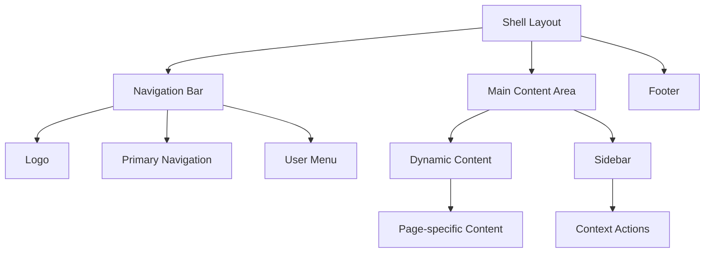

### 5.1.2 Key Interface Components

| Component | Description | Interactions |
|-----------|-------------|--------------|
| Navigation Bar | Fixed top bar with logo, main nav, and user menu | - Dropdown menus<br>- Active state indicators |
| Dashboard Grid | Card-based layout for key metrics and actions | - Drag-and-drop organization<br>- Real-time updates |
| Check Wizard | Multi-step form for initiating background checks | - Progress indicator<br>- Validation feedback |
| Document Uploader | Drag-and-drop interface for file uploads | - Preview functionality<br>- Progress tracking |
| Interview Portal | Split-screen layout for video and questions | - Camera controls<br>- Timer display |

### 5.1.3 Responsive Breakpoints

| Breakpoint | Layout Changes |
|------------|----------------|
| Mobile (<640px) | - Single column layout<br>- Hamburger menu<br>- Stacked cards |
| Tablet (640px-1024px) | - Two column layout<br>- Condensed navigation<br>- Grid layout |
| Desktop (>1024px) | - Full navigation<br>- Multi-column layout<br>- Sidebar visible |

## 5.2 DATABASE DESIGN

### 5.2.1 Schema Design

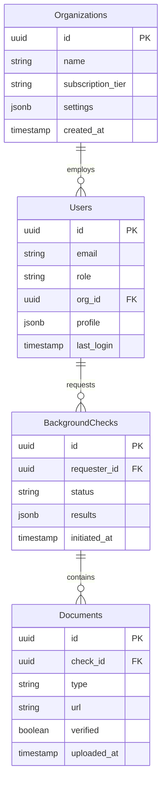

### 5.2.2 Data Access Patterns

| Pattern | Implementation | Purpose |
|---------|----------------|----------|
| Read-heavy Access | Read replicas + Cache | Dashboard and status views |
| Write-heavy Access | Primary-only writes | Document uploads and verifications |
| Search Operations | Full-text search index | User and organization lookup |
| Analytics Queries | Materialized views | Reporting and metrics |

## 5.3 API DESIGN

### 5.3.1 REST Endpoints

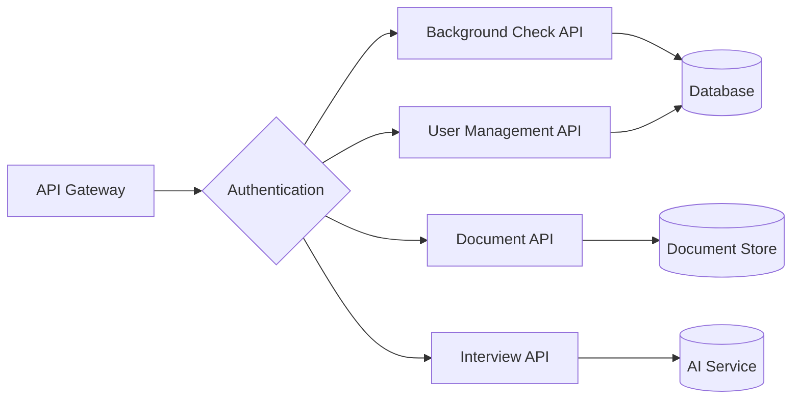

### 5.3.2 API Routes

| Endpoint | Method | Purpose | Authentication |
|----------|---------|---------|----------------|
| /api/v1/checks | POST | Create new background check | JWT Required |
| /api/v1/checks/:id | GET | Retrieve check status | JWT Required |
| /api/v1/documents | POST | Upload verification document | JWT Required |
| /api/v1/interviews | POST | Schedule AI interview | JWT Required |
| /api/v1/users | GET | List organization users | Admin Only |

### 5.3.3 WebSocket Events

| Event | Direction | Purpose |
|-------|-----------|---------|
| check.status_update | Server → Client | Real-time status updates |
| interview.ready | Server → Client | Interview session ready |
| document.verified | Server → Client | Document verification complete |
| user.activity | Client → Server | User presence tracking |

### 5.3.4 Integration Patterns

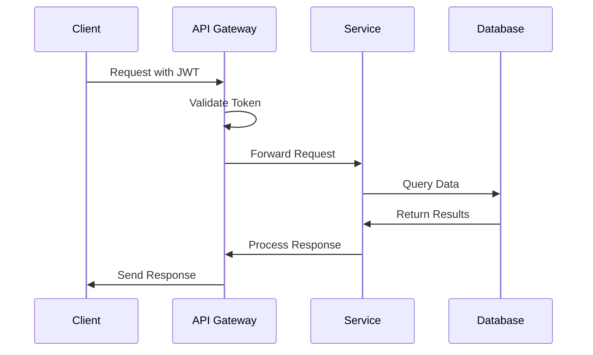

### 5.3.5 Error Handling

| Error Code | Description | Response Format |
|------------|-------------|-----------------|
| 400 | Bad Request | {error: string, details: object} |
| 401 | Unauthorized | {error: string, redirect: string} |
| 403 | Forbidden | {error: string, required_role: string} |
| 404 | Not Found | {error: string, resource: string} |
| 500 | Server Error | {error: string, reference: string} |

# 6. USER INTERFACE DESIGN

## 6.1 Design System

The user interface follows Material Design 3.0 principles implemented through shadcn/ui components and Tailwind CSS, with a consistent color scheme and typography.

### Component Key
```
Icons:
[?] - Help/Information tooltip
[$] - Payment/Billing related
[i] - Information display
[+] - Add new/Create
[x] - Close/Delete/Remove
[<] [>] - Navigation controls
[^] - Upload functionality
[#] - Dashboard/Menu
[@] - User profile
[!] - Alert/Warning
[=] - Settings menu
[*] - Important/Favorite

Interactive Elements:
[ ] - Checkbox
( ) - Radio button
[Button] - Clickable button
[...] - Text input field
[====] - Progress indicator
[v] - Dropdown menu
```

## 6.2 Main Dashboard

```
+----------------------------------------------------------+
|  Precheck.me                              [@] [?] [=]     |
+----------------------------------------------------------+
|  [#] Dashboard                                            |
|  +-- Background Checks                                    |
|  +-- Interviews                                          |
|  +-- Reports                                             |
|  +-- Settings                                            |
+----------------------------------------------------------+
|                                                          |
|  Active Background Checks                    [+ New Check]|
|  +-------------------+  +-------------------+            |
|  | John Doe          |  | Sarah Smith       |            |
|  | [====----] 50%    |  | [=======---] 70%  |            |
|  | Started: 2/1/24   |  | Started: 2/3/24   |            |
|  | [View Details]    |  | [View Details]    |            |
|  +-------------------+  +-------------------+            |
|                                                          |
|  Pending Interviews                      [+ Schedule]    |
|  +-------------------+  +-------------------+            |
|  | Technical Role    |  | Management Role   |            |
|  | 3 Candidates      |  | 2 Candidates      |            |
|  | Due: 2/10/24      |  | Due: 2/15/24      |            |
|  | [Manage]          |  | [Manage]          |            |
|  +-------------------+  +-------------------+            |
|                                                          |
+----------------------------------------------------------+
```

## 6.3 Background Check Creation

```
+----------------------------------------------------------+
|  New Background Check                         [x] Close    |
+----------------------------------------------------------+
|                                                          |
|  Candidate Information                                   |
|  Full Name: [..............................]             |
|  Email:    [..............................]             |
|                                                          |
|  Check Type:                                            |
|  ( ) Basic - Identity & Employment                      |
|  ( ) Standard - Including Education                      |
|  ( ) Comprehensive - Full Background                     |
|                                                          |
|  Required Documents:                                     |
|  [ ] Government ID                                       |
|  [ ] Proof of Address                                    |
|  [ ] Employment Records                                  |
|                                                          |
|  Upload Documents: [^ Select Files]                      |
|                                                          |
|  Package Details:                                        |
|  +------------------------+                              |
|  | Standard Package       |                              |
|  | [$] 99.99             |                              |
|  | - Employment Check     |                              |
|  | - Education Check      |                              |
|  | - Identity Check      |                              |
|  +------------------------+                              |
|                                                          |
|  [Cancel]                    [Initiate Background Check] |
+----------------------------------------------------------+
```

## 6.4 Interview Portal

```
+----------------------------------------------------------+
|  AI Interview Session                       [!] Recording  |
+----------------------------------------------------------+
|  +----------------------+  +------------------------+      |
|  |                      |  | Question 3 of 10       |      |
|  |   [Video Feed]       |  | [====------] 30%       |      |
|  |                      |  |                        |      |
|  |                      |  | "Describe a challenging|      |
|  |   [@] Candidate      |  |  project you managed." |      |
|  |                      |  |                        |      |
|  +----------------------+  | Time Left: 2:30        |      |
|                           +------------------------+      |
|  Audio Levels: [=========]                               |
|                                                          |
|  Controls:                                               |
|  [Pause] [Stop] [Next Question] [End Interview]          |
|                                                          |
|  Notes:                                                  |
|  [...................................................] |
|                                                          |
+----------------------------------------------------------+
```

## 6.5 Document Verification

```
+----------------------------------------------------------+
|  Document Verification                      [@] [?]        |
+----------------------------------------------------------+
|  Document Queue                            [+ Add More]    |
|  +-------------------+  +-------------------+             |
|  | Passport.pdf      |  | Degree.pdf        |             |
|  | [=====-----] 50%  |  | [Verified ✓]      |             |
|  | Uploaded: 2/1/24  |  | Verified: 2/2/24   |             |
|  | [View] [x]        |  | [View] [x]         |             |
|  +-------------------+  +-------------------+             |
|                                                          |
|  Verification Status                                     |
|  +--------------------------------------------------+  |
|  | Document      | Status    | Notes          | Date  |  |
|  |--------------|-----------|----------------|-------|  |
|  | Passport     | Pending   | Processing... | 2/1/24 |  |
|  | Degree       | Complete  | Authentic     | 2/2/24 |  |
|  +--------------------------------------------------+  |
|                                                          |
|  [Download Report]              [Request Manual Review]  |
+----------------------------------------------------------+
```

## 6.6 Mobile Responsive Layouts

### Mobile Dashboard
```
+----------------------+
| Precheck.me     [=] |
+----------------------+
| [@] John Smith      |
| HR Manager          |
+----------------------+
| [#] Menu            |
| +-- Checks          |
| +-- Interviews      |
| +-- Documents       |
| +-- Settings        |
+----------------------+
| Active Checks (3)   |
| +------------------+|
| | Sarah Smith      ||
| | [====----] 50%   ||
| | [View]           ||
| +------------------+|
| | James Brown      ||
| | [======--] 75%   ||
| | [View]           ||
| +------------------+|
+----------------------+
| [+ New Check]       |
+----------------------+
```

### Mobile Interview View
```
+----------------------+
| Interview      [x]  |
+----------------------+
| [Video Feed]        |
|                     |
| [@] Candidate      |
+----------------------+
| Question 2/5        |
| [===------] 30%    |
|                     |
| "Describe your     |
| role in your last  |
| project."          |
|                     |
| Time: 1:45         |
+----------------------+
| [Pause] [Next]      |
+----------------------+
```

# 7. SECURITY CONSIDERATIONS

## 7.1 AUTHENTICATION AND AUTHORIZATION

### 7.1.1 Authentication Methods

| Method | Implementation | Use Case |
|--------|----------------|----------|
| Email/Password | NextAuth.js with bcrypt | Primary authentication |
| OAuth 2.0 | Google, LinkedIn providers | Social login |
| Multi-factor Authentication | Time-based OTP (TOTP) | Additional security layer |
| API Authentication | JWT with RS256 signing | Service-to-service auth |
| Session Management | Redis-backed sessions | User session tracking |

### 7.1.2 Authorization Model

```mermaid
flowchart TD
    A[User Request] --> B{Authentication}
    B -->|Invalid| C[Login Required]
    B -->|Valid| D{Role Check}
    
    D -->|Admin| E[Full Access]
    D -->|Company| F[Company Resources]
    D -->|Candidate| G[Candidate Resources]
    
    F --> H{Permission Check}
    H -->|Allowed| I[Resource Access]
    H -->|Denied| J[Access Denied]
    
    G --> K{Profile Owner?}
    K -->|Yes| L[Profile Access]
    K -->|No| J
```

### 7.1.3 Role-Based Access Control (RBAC)

| Role | Permissions | Access Level |
|------|------------|--------------|
| System Admin | All system functions | Full system access |
| Company Admin | Company management, all checks | Company-wide access |
| HR Manager | Background check initiation, reports | Department-level access |
| Candidate | Profile management, document upload | Self-profile access |
| API Client | Specific API endpoints | Limited API access |

## 7.2 DATA SECURITY

### 7.2.1 Encryption Standards

```mermaid
flowchart LR
    subgraph "Data at Rest"
        A[Database] -->|AES-256| B[Encrypted Storage]
        C[Documents] -->|AES-256| D[Encrypted Files]
    end
    
    subgraph "Data in Transit"
        E[Client] -->|TLS 1.3| F[Server]
        G[Services] -->|mTLS| H[Internal APIs]
    end
```

### 7.2.2 Data Protection Measures

| Data Type | Protection Method | Additional Controls |
|-----------|------------------|-------------------|
| PII | Field-level encryption | Data masking, access logging |
| Documents | Client-side encryption | Virus scanning, integrity checks |
| Credentials | Salted hashing (Argon2) | Password policies, breach detection |
| API Keys | Hardware Security Module | Key rotation, usage monitoring |
| Audit Logs | Immutable storage | Digital signatures |

### 7.2.3 Data Classification

| Level | Description | Security Requirements |
|-------|-------------|---------------------|
| Critical | Passwords, keys, financial data | Encryption, strict access control |
| Sensitive | PII, background check results | Encryption, limited access |
| Internal | Company information | Standard protection |
| Public | Marketing content | Basic protection |

## 7.3 SECURITY PROTOCOLS

### 7.3.1 Network Security

```mermaid
flowchart TD
    A[Internet] -->|TLS| B[WAF]
    B -->|Filter| C[Load Balancer]
    C -->|mTLS| D[Application Servers]
    D -->|Encrypted| E[Database]
    
    F[Admin Access] -->|VPN| G[Management Network]
    G -->|IAM| D
```

### 7.3.2 Security Controls

| Control Type | Implementation | Purpose |
|--------------|----------------|----------|
| WAF | AWS WAF/Cloudflare | DDoS protection, threat blocking |
| Rate Limiting | Redis-based tracking | Prevent abuse |
| Input Validation | Server-side validation | Prevent injection attacks |
| Session Security | Secure cookies, CSRF tokens | Prevent session hijacking |
| Monitoring | ELK Stack | Security event detection |

### 7.3.3 Security Compliance

```mermaid
flowchart LR
    subgraph "Compliance Framework"
        A[GDPR] --> B[Data Protection]
        C[SOC 2] --> D[Security Controls]
        E[ISO 27001] --> F[Security Management]
    end
    
    subgraph "Implementation"
        B --> G[Privacy Features]
        D --> H[Security Measures]
        F --> I[Processes]
    end
```

### 7.3.4 Security Response

| Event Type | Response | SLA |
|------------|----------|-----|
| Security Breach | Incident response plan activation | 15 minutes |
| Suspicious Activity | Investigation and monitoring | 1 hour |
| Vulnerability Report | Assessment and patching | 24 hours |
| Access Violation | Account lockout and review | Immediate |
| System Attack | Traffic filtering and blocking | Automatic |

### 7.3.5 Regular Security Measures

- Weekly automated vulnerability scanning
- Monthly penetration testing
- Quarterly security audits
- Annual third-party security assessment
- Continuous security monitoring and alerting
- Regular security awareness training for staff

# 8. INFRASTRUCTURE

## 8.1 DEPLOYMENT ENVIRONMENT

The system utilizes a cloud-native architecture with multi-region deployment for high availability and disaster recovery.

### Environment Strategy

| Environment | Purpose | Infrastructure | Scaling Strategy |
|-------------|---------|----------------|------------------|
| Development | Feature development, testing | AWS ECS (Single region) | Manual scaling |
| Staging | Integration testing, UAT | AWS ECS (Single region) | Auto-scaling (min 2, max 4) |
| Production | Live system | AWS ECS (Multi-region) | Auto-scaling (min 3, max 10) |
| DR Site | Disaster recovery | AWS ECS (Secondary region) | Warm standby |

### Regional Distribution

```mermaid
flowchart TD
    subgraph "Primary Region US-EAST-1"
        A[Load Balancer] --> B[ECS Cluster]
        B --> C[Container 1]
        B --> D[Container 2]
        B --> E[Container 3]
        F[(RDS Primary)] --> G[(RDS Replica)]
    end
    
    subgraph "DR Region US-WEST-2"
        H[Load Balancer] --> I[ECS Cluster]
        I --> J[Container 1]
        I --> K[Container 2]
        L[(RDS Standby)]
    end
    
    M[Route 53] --> A
    M --> H
    G --> L
```

## 8.2 CLOUD SERVICES

### AWS Service Selection

| Service | Purpose | Configuration |
|---------|----------|--------------|
| ECS Fargate | Container orchestration | Serverless compute |
| RDS PostgreSQL | Primary database | Multi-AZ, 15.x version |
| ElastiCache Redis | Session/cache management | Cluster mode enabled |
| S3 | Document storage | Versioning enabled |
| CloudFront | CDN for static assets | Global edge locations |
| Route 53 | DNS management | Latency-based routing |
| ACM | SSL certificate management | Auto-renewal enabled |
| CloudWatch | Monitoring and logging | Custom metrics enabled |
| AWS Backup | Automated backups | Cross-region replication |

### Service Architecture

```mermaid
flowchart LR
    A[CloudFront] --> B[ALB]
    B --> C[ECS Fargate]
    C --> D[RDS]
    C --> E[ElastiCache]
    C --> F[S3]
    
    G[Route 53] --> A
    G --> B
    
    H[CloudWatch] --> C
    H --> D
    H --> E
    
    I[AWS Backup] --> D
    I --> F
```

## 8.3 CONTAINERIZATION

### Docker Configuration

```mermaid
flowchart TD
    subgraph "Container Architecture"
        A[Next.js App] --> B[Base Node Image]
        C[API Services] --> B
        D[Background Workers] --> B
    end
    
    subgraph "Image Layers"
        E[OS Layer] --> F[Node Runtime]
        F --> G[Dependencies]
        G --> H[Application Code]
    end
```

### Container Specifications

| Container Type | Base Image | Resource Limits | Scaling Strategy |
|---------------|------------|-----------------|------------------|
| Web Application | node:20-alpine | 2 vCPU, 4GB RAM | Horizontal |
| API Services | node:20-alpine | 2 vCPU, 4GB RAM | Horizontal |
| Background Workers | node:20-alpine | 1 vCPU, 2GB RAM | Queue-based |
| AI Processing | python:3.11-slim | 4 vCPU, 8GB RAM | Job-based |

## 8.4 ORCHESTRATION

### ECS Configuration

```mermaid
flowchart TD
    subgraph "ECS Cluster"
        A[Service Discovery] --> B[Task Definitions]
        B --> C[Web Services]
        B --> D[Worker Services]
        
        C --> E[Web Tasks]
        D --> F[Worker Tasks]
        
        G[Auto Scaling] --> C
        G --> D
    end
```

### Task Definitions

| Service | CPU Units | Memory | Auto-scaling Triggers |
|---------|-----------|---------|---------------------|
| Web | 1024 | 2GB | CPU > 70%, Memory > 80% |
| API | 1024 | 2GB | Request Count > 1000/min |
| Worker | 512 | 1GB | Queue Length > 100 |
| AI Service | 2048 | 4GB | Processing Time > 30s |

## 8.5 CI/CD PIPELINE

### Pipeline Architecture

```mermaid
flowchart LR
    A[GitHub] --> B[GitHub Actions]
    B --> C{Tests Pass?}
    C -->|Yes| D[Build Images]
    C -->|No| E[Notify Team]
    D --> F[Push to ECR]
    F --> G{Environment?}
    G -->|Staging| H[Deploy to Staging]
    G -->|Production| I[Manual Approval]
    I -->|Approved| J[Deploy to Production]
    H & J --> K[Health Checks]
    K -->|Failed| L[Rollback]
    K -->|Success| M[Notify Success]
```

### Deployment Stages

| Stage | Trigger | Actions | Approvals |
|-------|---------|---------|-----------|
| Build | Push to main | Code build, tests, security scan | Automated |
| Staging | Successful build | Deploy to staging, integration tests | Automated |
| Production | Manual trigger | Blue/green deployment | Required |
| Rollback | Failed health check | Revert to previous version | Automated |

### Pipeline Metrics

| Metric | Target | Alert Threshold |
|--------|--------|----------------|
| Build Time | < 10 minutes | > 15 minutes |
| Test Coverage | > 80% | < 75% |
| Deployment Time | < 15 minutes | > 20 minutes |
| Rollback Time | < 5 minutes | > 10 minutes |
| Success Rate | > 95% | < 90% |

# APPENDICES

## A.1 Additional Technical Information

### A.1.1 Development Environment Setup

```mermaid
flowchart TD
    A[Development Setup] --> B[Version Control]
    A --> C[Local Environment]
    A --> D[CI Pipeline]
    
    B --> E[GitHub]
    B --> F[Git LFS]
    
    C --> G[Node.js 20.x]
    C --> H[pnpm]
    C --> I[Docker]
    
    D --> J[GitHub Actions]
    D --> K[ESLint/Prettier]
    D --> L[Jest]
```

### A.1.2 Performance Benchmarks

| Metric | Target | Measurement Method |
|--------|--------|-------------------|
| Time to First Byte | < 200ms | Lighthouse |
| First Contentful Paint | < 1.5s | Web Vitals |
| Total Blocking Time | < 300ms | Lighthouse |
| Largest Contentful Paint | < 2.5s | Web Vitals |
| Cumulative Layout Shift | < 0.1 | Web Vitals |

### A.1.3 Error Handling Matrix

| Error Type | Handling Strategy | User Communication |
|------------|------------------|-------------------|
| Network Timeout | Retry with exponential backoff | "Connection issue. Retrying..." |
| Validation Error | Field-level error display | Inline error messages |
| Authentication Error | Redirect to login | Session expired notification |
| API Error | Graceful degradation | User-friendly error message |
| File Upload Error | Chunked upload retry | Progress indicator with retry option |

## A.2 GLOSSARY

| Term | Definition |
|------|------------|
| Blue/Green Deployment | Deployment strategy using two identical environments for zero-downtime updates |
| Content Delivery Network | Distributed server network optimizing content delivery based on user location |
| Dark Mode | Alternative color scheme optimized for low-light environments |
| Edge Function | Serverless function executed at CDN edge locations |
| Hot Module Replacement | Development feature enabling real-time code updates without page refresh |
| Hydration | Process of attaching JavaScript event handlers to server-rendered HTML |
| Middleware | Software layer handling cross-cutting concerns between application layers |
| Server-Side Rendering | Generation of HTML on the server for improved initial page load |
| Webhook | HTTP callback mechanism for real-time system notifications |
| Zero-Trust Security | Security model requiring verification of every access attempt |

## A.3 ACRONYMS

| Acronym | Full Form |
|---------|-----------|
| API | Application Programming Interface |
| AWS | Amazon Web Services |
| CDN | Content Delivery Network |
| CI/CD | Continuous Integration/Continuous Deployment |
| CORS | Cross-Origin Resource Sharing |
| CSP | Content Security Policy |
| DDoS | Distributed Denial of Service |
| DNS | Domain Name System |
| HRIS | Human Resource Information System |
| HTML | HyperText Markup Language |
| HTTP | HyperText Transfer Protocol |
| HTTPS | HyperText Transfer Protocol Secure |
| IAM | Identity and Access Management |
| JSON | JavaScript Object Notation |
| JWT | JSON Web Token |
| MFA | Multi-Factor Authentication |
| ORM | Object-Relational Mapping |
| PII | Personally Identifiable Information |
| REST | Representational State Transfer |
| SDK | Software Development Kit |
| SQL | Structured Query Language |
| SSR | Server-Side Rendering |
| TLS | Transport Layer Security |
| UI | User Interface |
| URL | Uniform Resource Locator |
| UUID | Universally Unique Identifier |
| WAF | Web Application Firewall |
| XSS | Cross-Site Scripting |

## A.4 REFERENCE ARCHITECTURE

```mermaid
C4Context
    title Reference Architecture - Precheck.me Platform

    Person(user, "End User", "System user accessing platform")
    
    System_Boundary(platform, "Precheck.me Platform") {
        Container(frontend, "Next.js Frontend", "React, TypeScript")
        Container(api, "API Layer", "Next.js API Routes")
        Container(worker, "Background Workers", "Node.js")
        Container(ai, "AI Services", "ML Processing")
    }
    
    System_Ext(storage, "Storage Services", "S3, PostgreSQL, Redis")
    System_Ext(external, "External Services", "Payment, Email, HRIS")
    
    Rel(user, frontend, "Uses", "HTTPS")
    Rel(frontend, api, "Calls", "REST/WebSocket")
    Rel(api, worker, "Triggers", "Message Queue")
    Rel(api, ai, "Processes", "gRPC")
    Rel(api, storage, "Stores", "Multiple Protocols")
    Rel(api, external, "Integrates", "REST/SMTP")
```